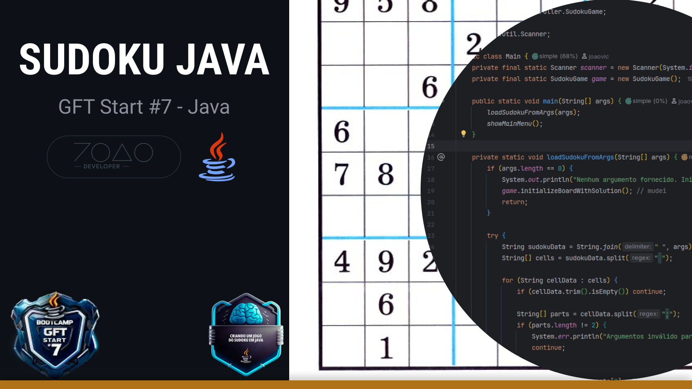

# 🎯 SUDOKU JAVA

[](https://web.dio.me/track/decola-tech-avanade-net-developer?tab=path)

[](https://web.dio.me/track/decola-tech-avanade-net-developer?tab=path)

<div align="center">

[](https://skillicons.dev)

</div>

### 🧩 Jogo de ‘Sudoku’ completo criado em Java</h3>
Desenvolvido como desafio do Bootcamp da [Digital Innovation One.](https://web.dio.me/)

---

[](https://web.dio.me/track/decola-tech-avanade-net-developer?tab=path)

---

## 🚀 Como Executar

### 📋 Pré-requisitos
- **Java**: Versão `21.0.8-oracle` ou superior
- **IDE**: IntelliJ IDEA (recomendado) ou qualquer editor Java

### 🎲 Configuração Personalizada (Argumentos Opcionais)
Você pode inicializar o ‘Sudoku’ com uma configuração específica usando argumentos:
```txt
0,0;4,false 1,0;7,false 2,0;9,true 3,0;5,false 4,0;8,true 5,0;6,true 6,0;2,true 7,0;3,false 8,0;1,false 0,1;1,false 1,1;3,true 2,1;5,false 3,1;4,false 4,1;7,true 5,1;2,false 6,1;8,false 7,1;9,true 8,1;6,true 0,2;2,false 1,2;6,true 2,2;8,false 3,2;9,false 4,2;1,true 5,2;3,false 6,2;7,false 7,2;4,false 8,2;5,true 0,3;5,true 1,3;1,false 2,3;3,true 3,3;7,false 4,3;6,false 5,3;4,false 6,3;9,false 7,3;8,true 8,3;2,false 0,4;8,false 1,4;9,true 2,4;7,false 3,4;1,true 4,4;2,true 5,4;5,true 6,4;3,false 7,4;6,true 8,4;4,false 0,5;6,false 1,5;4,true 2,5;2,false 3,5;3,false 4,5;9,false 5,5;8,false 6,5;1,true 7,5;5,false 8,5;7,true 0,6;7,true 1,6;5,false 2,6;4,false 3,6;2,false 4,6;3,true 5,6;9,false 6,6;6,false 7,6;1,true 8,6;8,false 0,7;9,true 1,7;8,true 2,7;1,false 3,7;6,false 4,7;4,true 5,7;7,false 6,7;5,false 7,7;2,true 8,7;3,false 0,8;3,false 1,8;2,false 2,8;6,true 3,8;8,true 4,8;5,true 5,8;1,false 6,8;4,true 7,8;7,false 8,8;9,false
```

---

## 🎬 Demonstração

### 📱 Menu Principal
```
Selecione uma das opções a seguir
1 - Iniciar um novo Jogo
2 - Colocar um novo número
3 - Remover um número
4 - Visualizar jogo atual
5 - Verificar status do jogo
6 - limpar jogo
7 - Finalizar jogo
8 - Sair
```

### 🎮 Tabuleiro do Jogo
```
          0           1           2           3           4           5           6           7           8
    ╔═══════════╤═══════════╤═══════════╦═══════════╤═══════════╤═══════════╦═══════════╤═══════════╤═══════════╗
    ╠═══════════╪═══════════╪═══════════╬═══════════╪═══════════╪═══════════╬═══════════╪═══════════╪═══════════╣
 0  ║           │           │     9     │           │     8     │     6     │     2     │           │           ╢
    ╟───────────┼───────────┼───────────╫───────────┼───────────┼───────────╫───────────┼───────────┼───────────╢
 1  ║           │     3     │           │           │     7     │           │           │     9     │     6     ╢
    ╟───────────┼───────────┼───────────╫───────────┼───────────┼───────────╫───────────┼───────────┼───────────╢
 2  ║           │     6     │           │           │     1     │           │           │           │     5     ╢
    ╠═══════════╪═══════════╪═══════════╬═══════════╪═══════════╪═══════════╬═══════════╪═══════════╪═══════════╣
 3  ║     5     │           │     3     │           │           │           │           │     8     │           ╢
    ╚═══════════╧═══════════╧═══════════╩═══════════╧═══════════╧═══════════╩═══════════╧═══════════╧═══════════╝
```

### 📊 Status do Jogo
```
📊 === STATUS DO JOGO ===
Jogo iniciado: Sim
Células corretas: 25
Células com erros: 0
Células vazias: 56

✅ Não há erros! Continue preenchendo as células vazias.
==============================
```


---

## 🎮 Funcionalidades

> 📚 **Sobre o Sudoku**: [Wikipédia - Sudoku](https://pt.wikipedia.org/wiki/Sudoku)

Este jogo implementa todas as regras clássicas do ‘Sudoku’ com um menu interativo completo.

### ✅ Funcionalidades Implementadas

| Funcionalidade | Descrição | Status |
|---|---|:---:|
| **🎯 1. Iniciar Jogo** | Exibe o tabuleiro inicial com números pré-definidos | ✅ |
| **➕ 2. Colocar Número** | Permite inserir números nas posições válidas | ✅ |
| **❌ 3. Remover Número** | Remove números (exceto os fixos do jogo) | ✅ |
| **👁️ 4. Visualizar Jogo** | Mostra o estado atual do tabuleiro | ✅ |
| **📊 5. Verificar Status** | Analisa erros e completude do jogo | ✅ |
| **🧹 6. Limpar Jogo** | Remove apenas números do jogador | ✅ |
| **🏆 7. Finalizar Jogo** | Verifica vitória e encerra o jogo | ✅ |

### 🔧 Validações Implementadas

- ✅ **Regras do Sudoku**: Validação completa de linhas, colunas e quadrantes 3x3
- ✅ **Proteção de Células Fixas**: Números iniciais não podem ser alterados
- ✅ **Detecção de Conflitos**: Identifica e reporta erros em tempo real
- ✅ **‘Interface’ Intuitiva**: Menu interativo com ‘feedback’ detalhado
- ✅ **Tratamento de Erros**: Validação de entrada e mensagens informativas

### 🎨 Arquitetura do Projeto

```
src/br/com/dio/
├── 📁 Main.java              # Ponto de entrada e controle do menu
├── 📁 controller/
│   └── SudokuGame.java       # Lógica principal do jogo
├── 📁 model/
│   └── Cell.java             # Modelo de célula do tabuleiro
└── 📁 view/
    └── BoardTemplate.java    # Template visual do tabuleiro
```

---

## 🔮 Requisitos Extras (Opcionais)

| Funcionalidade                        |       Status       | Observações                     |
|---------------------------------------|:------------------:|---------------------------------|
| 🖥️ **Interface Gráfica (AWT/Swing)** | ❌ Não implementado | Implementado apenas no terminal |
| ✏️ **Sistema de Rascunho**            | ❌ Não implementado | Funcionalidade não implementada |

### 🎯 Exemplos Visuais

#### Tabuleiro com Números


#### Modelo de Rascunho


---

## 🤝 Contribuindo

1. Faça um **fork** do projeto
2. Crie uma branch para a sua feature (`git checkout -b feature/AmazingFeature`)
3. Faça commit das mudanças (`git commit -m 'Add some AmazingFeature'`)
4. Push para a branch (`git push origin feature/AmazingFeature`)
5. Abra um **Pull Request**

---

## 📄 Licença

Este projeto foi desenvolvido como parte do bootcamp da **Digital Innovation One**.

---

<div align="center">
  <p>Desenvolvido com ☕ para esse desafio da <a href="https://web.dio.me/">DIO</a></p>
  <p>🧩 <strong>Divirta-se jogando Sudoku!</strong> 🧩</p>
</div>
